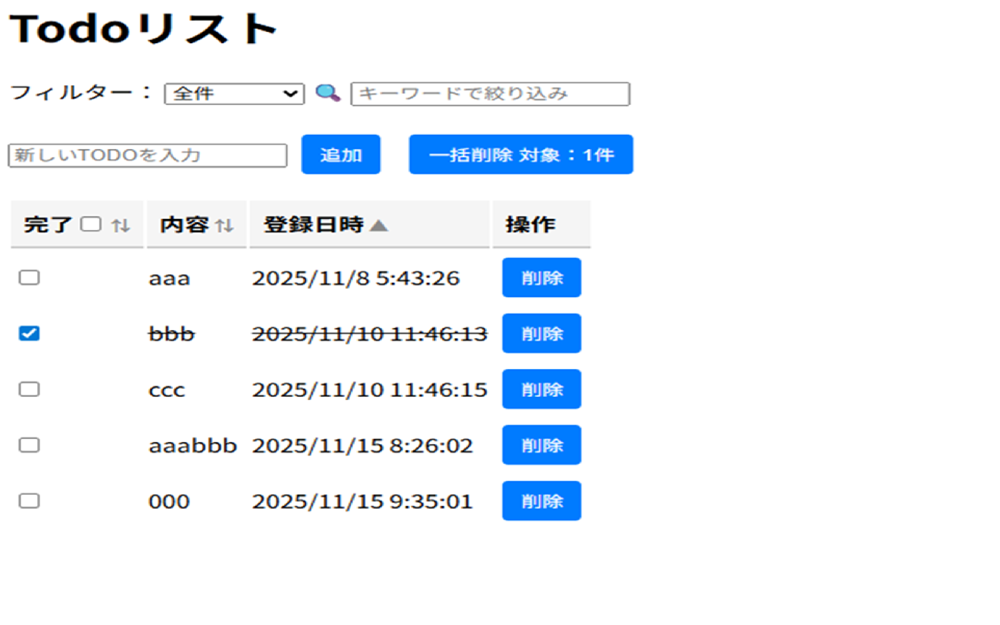

# PHP版 Todoリスト

このプロジェクトは、PHPで作成したシンプルなTodoリストです。  
React＋TypeScript版と同様の機能を段階的に実装しながら、フロントエンドとサーバーサイドの設計思想の違いを学ぶことを目的としています。

## 📌 目的

- PHPの基本構文・フォーム処理・状態管理の理解
- React＋TypeScriptとの設計・構造・データ管理の違いを比較
- 実践的な学習を通じて、UI/UXと保守性の両立を目指す

## 🛠 使用技術

- PHP 8.x
- HTML / CSS（必要に応じて）
- XAMPP（ローカル開発環境）

## 🚀 起動方法

1. `C:\work\study\php\my-todo-app` にソースを配置
2. `http://my-todo.local/TodoList.php` にアクセス（バーチャルホスト設定済）

## 📚 実装予定機能

- [x] Todoの一覧表示（配列）
- [x] 新規追加（フォーム）
- [x] 完了チェック
- [x] 編集・削除
- [ ] ソート・検索
- [ ] ファイル保存 or セッション管理

## 🔄 React版との比較ポイント

| 機能 | React＋TypeScript | PHP |
|------|-------------------|-----|
| 状態管理 | useState / useReducer | POST / セッション変数 |
| UI更新 | 仮想DOMで即時反映 | ページ再読み込み |
| イベント処理 | onClick / onChange | submit / $_POST |
| データ保存 | localStorage | ファイル / セッション |

---

## ✨ 今後の展望

- React版と同様の機能をすべてPHPで再現し、READMEに比較結果をまとめる予定です。
- UI/UXの改善や、保守性の高いコード構造を意識してリファクタリングを進めます。

## 更新履歴

- ✅ 追加・削除ボタンの追加（2025/11/05）
- ✅ 完了チェックボックスの追加（2025/11/06）
- ✅ todos.json 対応の追加（2025/11/07)
- ✅ SQLite へ移行（todos.json→todos.db）(2025/11/07)
- ✅ tableタグで列を整列し、視認性と構造を改善（2025/11/08）
- ✅ style.cssを作成し、スタイルを外部化して保守性アップ（2025/11/08）
- ✅ api.phpとTodoList.jsを分離し、非同期処理（fetch + async/await）でTodo操作を実装（2025/11/08）
- ✅ 編集機能の追加（2025/11/09）
- ✅ ヘッダチェックボックスの追加（2025/11/10）
- ✅ フォルダ構成の見直し（2025/11/10）
- ✅ 一括削除ボタンの追加（2025/11/10）

